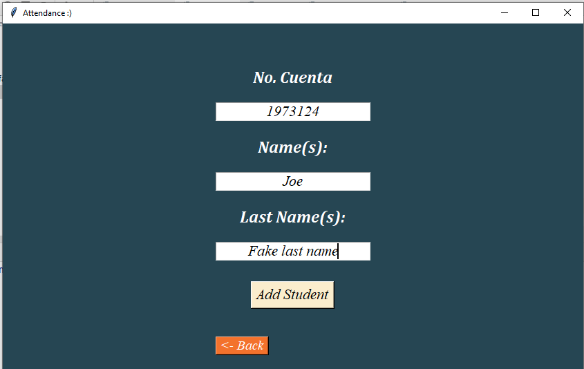
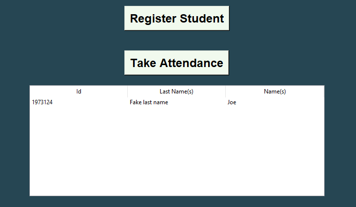
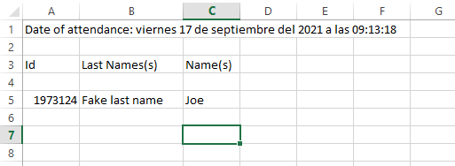

# Attendance Management
Attandance Management GUI using Artificial Vision with OpenCV.

## Setup for project (In case you hasn't installed).
> pip install tkinter \
> pip install xlsxwriter \
> pip install sqlite3 \
> pip install cv2 \
> pip install numpy

If you have some question or suggestion please send me your idea to 
my mail: kevincc62@gmail.com. :) 

##  Register some Student.

## Taking the attandance

## Showing the students in class

## Going to the Downloads directory and find the file created

