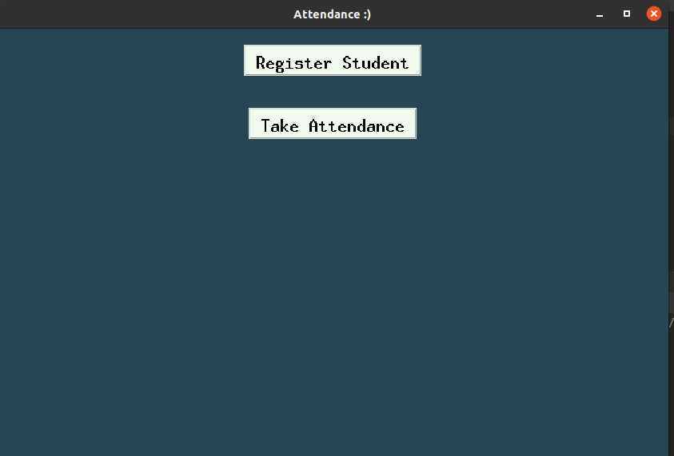

# Attendance Management
Attandance Management GUI using Artificial Vision with OpenCV.

## Setup for project (In case you hasn't installed).
> pip install tkinter \
> pip install xlsxwriter \
> pip install opencv (make sure that you have a python version less than 3.9) \

